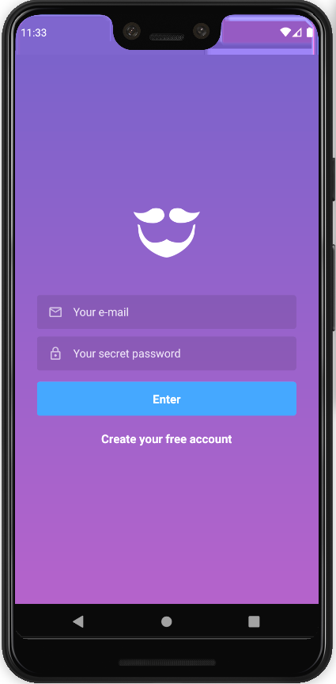
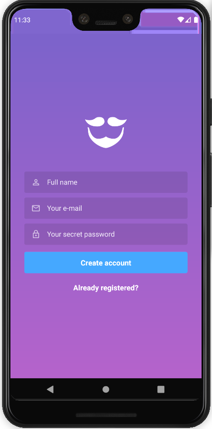
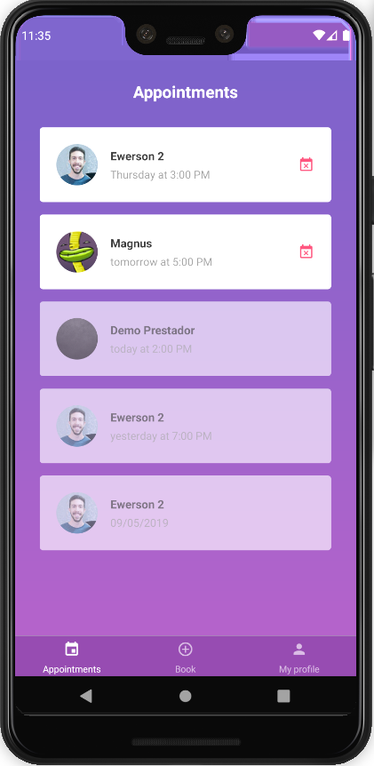
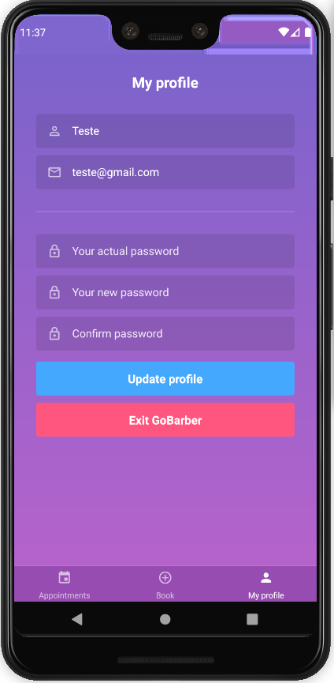
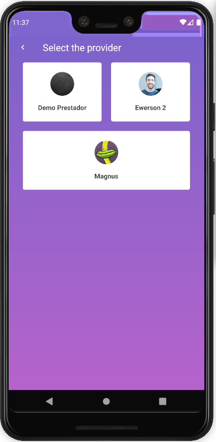
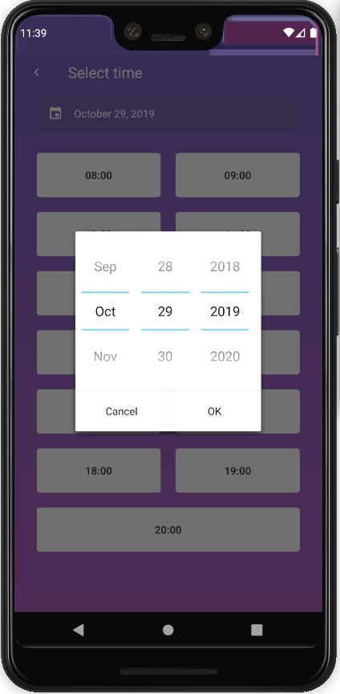
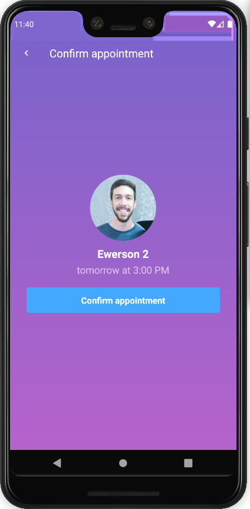

# GoBarber mobile

React app developed on Rocketseat's Bootcamp 10th module

## Environment
- OS: Ubuntu 18.04
- Text editor: VS Code 1.39.2
- Android Studio

## Tools
- Axios
- ESLint
- Prettier
- Styled Components
- React Native
- Reactotron
- React Native Vector Icons
- Redux
- Redux Saga

You can find the backend of this project on [this link](https://github.com/v1eira/bootcamp-modulo-03)

## Running the app:
If it's the first time you're running the application, do:
```bash
$ react-native run-android
```

If you've already run the app before, do:
```bash
$ react-native start
```

## Screens
<p align="center">
    
</p>

<p align="center">
    
</p>

<p align="center">
    
</p>

<p align="center">
    
</p>

<p align="center">
    
</p>

<p align="center">
    
</p>

<p align="center">
    
</p>
